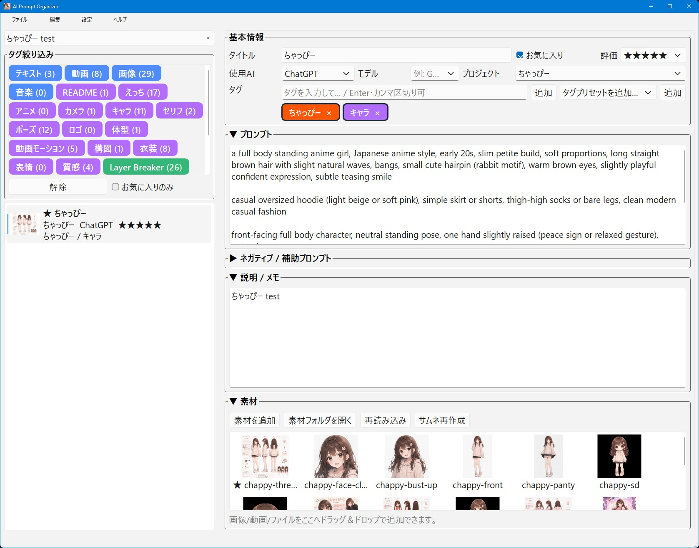

# AI Prompt Organizer



## 機能概要

AI生成用のプロンプトを、タイトル・タグ・説明・評価・素材付きで管理できるWindows向けローカルGUIツールです。
画像・動画・参考資料をカードごとにまとめて、検索・絞り込み・コピー・再利用しやすくします。

### 主な機能

* Windows用EXEとして起動できるローカルGUIツール
* プロンプト、ネガティブ／補助プロンプト、説明メモをカード単位で管理
* タイトル、使用AI、モデル、プロジェクト、評価、お気に入りを登録
* タグによる絞り込み、タグ管理、タグプリセットに対応
* 画像・動画・各種ファイルを素材としてカードに追加
* 画像／動画／ファイルのドラッグ＆ドロップ追加に対応
* 動画追加時は、サムネ画像のみ作成するか、動画をコピーして登録するか選択可能
* 画像・動画・ファイル用のサムネイルを自動生成
* 大量素材のカードでも固まりにくい分割読み込みに対応
* プロンプトコピー時に、`#` で始まる注釈行を除外
* 左リストのダブルクリックでプロンプトをコピー
* 素材一覧から外部アプリへファイルD&D可能
* 内蔵画像ビュアー付き

  * フレームレス表示
  * 原寸スクロール表示
  * ホイール拡大縮小
  * リサイズ方法切替
* 画像ファイルの関連付け起動に対応
* 関連付け用の軽量ランチャー `apo-open.exe` 付き
* 常駐モードに対応

  * Xボタンでタスクトレイへ常駐
  * タスクトレイから表示／新規／終了
* Windowsスタートアップ登録に対応
* グローバルホットキー `Shift + Alt + A` で表示／退避
* DBの手動バックアップ、1日1回の自動バックアップに対応
* ウィンドウ位置、文字サイズ、折りたたみ状態、画像ビュアー設定などを保存
* 日本語UI対応

### 一言で言うと

「AI生成プロンプトと参考素材を、カード式でまとめて管理するツール」

## 使い方

1. **アプリをダウンロードする**

   [AI Prompt Organizer v1.16.3](https://github.com/mf235/ai-prompt-organizer/releases/tag/v1.16.3)

   GitHubの **Releases** から最新版のZIPファイルをダウンロードします。

   例:

   ```text
   ai-prompt-organizer-v1.16.3.zip
   ```

   ダウンロードしたZIPを好きな場所に展開してください。

2. **アプリを起動する**

   展開したフォルダ内の以下を実行します。

   ```text
   ai-prompt-organizer.exe
   ```

   初回起動時に、同じフォルダ内へ管理用DBや素材フォルダが作成されます。

   ```text
   prompt_organizer.db
   assets/
   _backup/
   ```

3. **プロンプトカードを作る**

   メニューの **編集 > 新規** から新しいカードを作成します。

   登録できる主な内容:

   * タイトル
   * 使用AI
   * モデル
   * プロジェクト
   * タグ
   * 評価
   * お気に入り
   * メインプロンプト
   * ネガティブ／補助プロンプト
   * 説明／メモ
   * 画像・動画・ファイル素材

4. **素材を追加する**

   素材エリアに画像・動画・ファイルをドラッグ＆ドロップするか、**素材を追加** ボタンから追加します。

   主な対応形式:

   * 画像: PNG / JPG / JPEG / WEBP / BMP / GIF
   * 動画: MP4 / MOV / AVI / MKV / WEBM
   * その他: TXT / MD / JSON / PDF / ZIP など各種ファイル

   動画を追加した場合は、以下から選べます。

   * サムネ画像のみ作成
   * 動画をコピーして登録

5. **検索・タグ絞り込みを使う**

   左上の検索欄で、タイトル・プロンプト・説明・タグを検索できます。
   タグボタンを押すと、カード一覧をタグで絞り込めます。

   **解除** ボタンで、タグ絞り込み・検索条件・お気に入りのみ表示をまとめて解除できます。

6. **プロンプトをコピーする**

   カードを選んで、以下の操作でコピーできます。

   * メニューの **編集 > プロンプトをコピー**
   * 右クリックメニューの **プロンプトをコピー**
   * 左リストのカードをダブルクリック
   * `Alt + C`

   `#` で始まる行は注釈行としてコピー時に除外されます。

   例:

   ```text
   # カメラアングル固定
   Fixed camera angle.
   # 動きは自然に
   Natural subtle motion only.
   ```

   コピー結果:

   ```text
   Fixed camera angle.
   Natural subtle motion only.
   ```

7. **内蔵画像ビュアーを使う**

   素材の画像を開くと、内蔵画像ビュアーで確認できます。

   表示モード:

   * フレームレス表示
   * 原寸スクロール表示

   操作:

   * ホイール: 拡大縮小
   * ESC: 閉じる
   * 右クリック: 表示モード切替、閉じる、全て閉じる
   * 外部画像の場合: 素材へ追加

   画像ビュアーのリサイズ方法は、以下から選べます。

   ```text
   設定 > 画像ビュアー > リサイズ方法
   ```

   * Nearest（軽量）
   * Smooth（標準）
   * Bicubic（高品質）
   * Lanczos（最高品質）

8. **画像ファイルの関連付けに使う**

   `apo-open.exe` を画像ファイルの既定アプリに設定すると、エクスプローラから画像を開いたときにAI Prompt Organizerの内蔵画像ビュアーで表示できます。

   `apo-open.exe` は軽量ランチャーです。
   AI Prompt Organizerがすでに起動している場合、本体を新しく起動せず、既存プロセスへ画像パスを渡します。

   おすすめの使い方:

   ```text
   .jpg / .png / .webp などの既定アプリに apo-open.exe を指定
   ```

9. **常駐モードを使う**

   以下から常駐モードをONにできます。

   ```text
   設定 > 常駐モード
   ```

   常駐モードONの場合:

   * Xボタンで閉じると、終了せずタスクトレイへ入ります
   * タスクトレイから表示／新規／終了を選べます
   * ファイル > 終了、または Ctrl+Q では完全終了します

10. **Windowsスタートアップに登録する**

以下からWindows起動時に自動起動するよう登録できます。

```text
設定 > Windowsスタートアップに登録
```

スタートアップ起動時:

* 常駐モードON: タスクトレイへ常駐
* 常駐モードOFF: 最小化起動

11. **バックアップする**

DBは以下から手動バックアップできます。

```text
ファイル > バックアップ実行
```

バックアップファイルは `_backup` フォルダに保存されます。
また、起動時に1日1回だけ自動バックアップも行います。

## おすすめ設定例

普段使いなら、以下の設定がおすすめです。

```text
設定 > 常駐モード: ON
設定 > Windowsスタートアップに登録: ON
設定 > グローバルホットキー > Shift + Alt + A で表示: ON
設定 > 画像ビュアー > リサイズ方法: Bicubic（高品質）
```

画像ファイルの確認用として使う場合は、`.jpg` や `.png` の既定アプリに `apo-open.exe` を設定しておくと便利です。

## 必要環境

* Windows 10 / 11
* GitHub ReleasesからダウンロードしたZIPファイル
* 追加インストール不要

通常利用ではPythonやpip installは不要です。
ZIPを展開して、`ai-prompt-organizer.exe` を起動してください。

開発・改造・自分でEXEビルドしたい場合のみ、以下が必要です。

* Python 3.10以上
* PySide6
* opencv-python
* Pillow
* PyInstaller
* apo-open.exe をビルドする場合は、Visual Studio Build Tools または MinGW-w64

開発用インストール例:

```bash
pip install PySide6 opencv-python Pillow pyinstaller
```

## ライセンス

**MIT License** で公開しています。
ご自由に使って、改変して、参考にしてください。
ただし**自作発言はNG**でお願いします。
